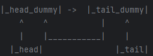
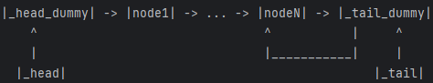
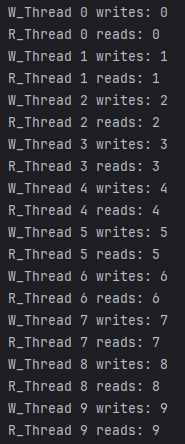
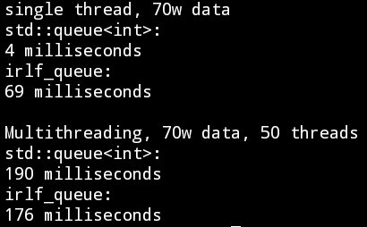

# irlf queue  


## statement
I am a middle school student  
this project has some **insufficient**  
you can see it as my learning outcomes  
maybe it can provide you some different ideas?  
I will improve it in the future  
sure, **welcome to make suggestions**
## basic information  
this is a singly lock-free queue  
it is very **simple**  
and it has a [`memory pool`](./src/irlf_memory_pool.hpp)
I will take it as a message queue and use it in my next project
  
it only has the header file, see it in [`irlf_queue.hpp`](./src/irlf_queue.hpp)  
### structure

---  
***basic_queue_structure:***  
  
***queue_structure:***  
  
its structure has two pictures in `./pic/`
---


**ATTENTION**, it doesn't have **GC**  
***maybe I will do it***  
of course, if you are interested in it, you can have a try

## member function  
- push(T data)  
> add a node  
- pop()  
> pop up a node  
> type is **node***  
- size()  
> return queue's size  
> type is **std::size_t**  

there are detailed explanation in source code file: [`irlf_queue.hpp`](./src/irlf_queue.hpp)

## use it
first, cmake it
```cmake
target_include_directories(YOUR_PROJECT PUBLIC
        ${CMAKE_SOURCE_DIR}/third_party/orin
)
```
then include it
```c++
#include "irlf_queue.hpp"
...
```
last, build it
```bash
bkdir build && cd build
cmake ..
make
```
if your project doesn't have other special settings  
doing this is enough

## example
I write a test file in [`test.cpp`](./examples/test.cpp)  
it creates 20 writing thread and 20 reading thread  
then run them together  
my PC  can run it successfully  
Termux  is the same situation
---
if you want to run it  
build it firstly:
```bash
bkdir build && cd build
cmake ..
make
```
then run
```bash
cd ../bin
./test
```
---
following is the one of outputs  
in order to avoid it looks too long  
I turn 20 to 10:  


## compare
I compare irlf_queue with std::queue [`compare.cpp`](./examples/compare.cpp)
output:  
  
in fact, std::queue being held back by std::mutex
mine being held back by new-delete  
so, I need a memory pool  
I will do it not very soon